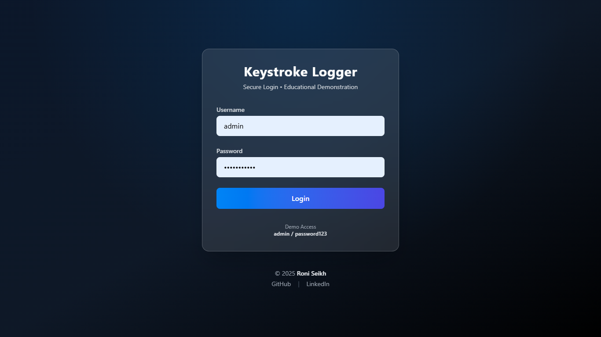
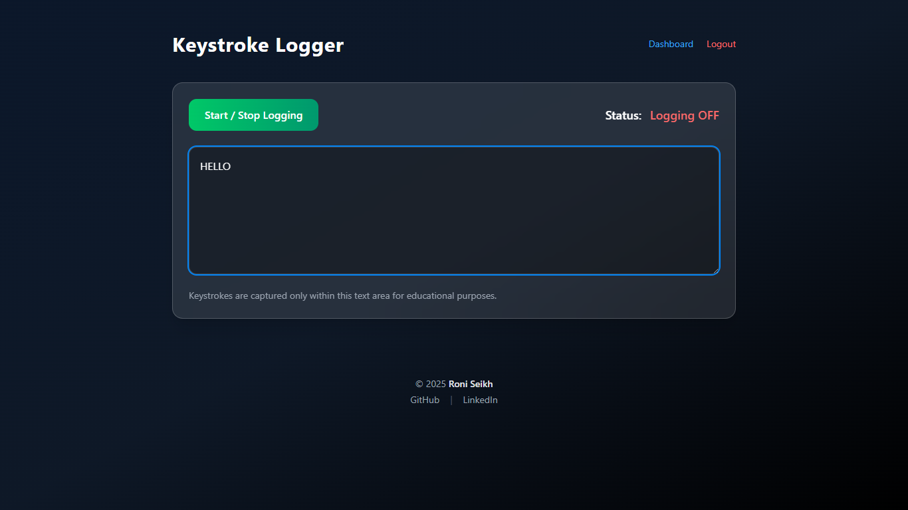
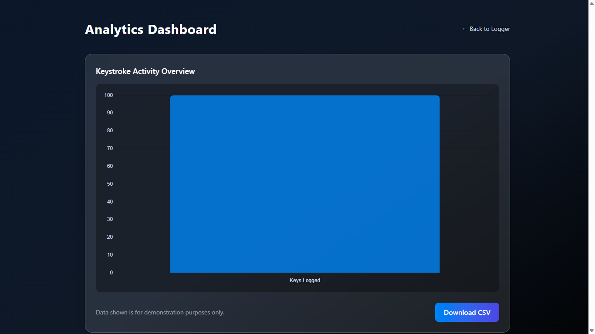

# 🔐 Keystroke Logging Demonstration Web Application  
**Cybersecurity with Generative AI – Internship Project**

---

## 📌 Project Overview

This project is a **Web-Based Keystroke Logging Demonstration System** developed as part of the **Edunet Foundation – AICTE Internship** under the **VOIS for Tech Program on Cybersecurity with Generative AI**.

The objective of this project is to **demonstrate how keystroke logging works in a controlled, ethical, and transparent environment**, while also highlighting **security awareness, encryption, authentication, and analytics**.

> ⚠️ **Disclaimer:**  
> This project is strictly for **educational and ethical demonstration purposes only**.  
> It does **not** perform system-wide or hidden keylogging.

---

## 🏢 Internship Program Details

**Offered By:**
- Edunet Foundation  
- AICTE  
- VOIS & Vodafone Idea Foundation – *VOIS for Tech Program*

### Program Focus
- Cybersecurity fundamentals  
- Threats and vulnerabilities  
- Generative AI in security  
- Network analysis using Wireshark  
- Ethical hacking frameworks  
- Real-world project development  

---

## 🎯 Project Objectives

- Demonstrate ethical keystroke logging within a web application  
- Implement secure authentication using Flask sessions  
- Encrypt logged data to ensure confidentiality  
- Provide analytics and visualization using Chart.js  
- Raise awareness about keylogging threats and defenses  

---

## 🛠️ Technologies Used

### Frontend
- HTML5  
- Tailwind CSS  
- JavaScript  
- Chart.js  

### Backend
- Python  
- Flask  
- Gunicorn  

### Security
- AES-based encryption (Cryptography library)  
- Session-based authentication  

---

## 🔐 Key Features

- Secure login system  
- Start / Stop keystroke logging  
- Logs keystrokes **only inside a textarea**  
- AES-encrypted log storage  
- Dashboard with graphical analytics  
- CSV export of logged data  
- Professional UI with animations and hover effects  

---

## 📸 Screenshots

### 🔑 Login Page


### ⌨️ Keystroke Logger Interface


### 📊 Analytics Dashboard


---

## ▶️ How to Run the Project Locally

### 1️⃣ Clone the Repository
```bash
git clone https://github.com/Roni-Seikh/keystroke-logger.git
cd keystroke-logger
````

---

## 🚀 Setup & Execution Guide

### Create Virtual Environment

```bash
python -m venv venv
```

### Activate Virtual Environment

**Windows**

```bash
venv\Scripts\activate
```

**Linux / macOS**

```bash
source venv/bin/activate
```

### Install Dependencies

```bash
pip install -r requirements.txt
```

### Run the Application

```bash
python app.py
```

### Open in Browser

```
http://127.0.0.1:5000
```

---

## 🧠 Ethical Considerations

* No system-level keylogging
* Logging is user-visible and consent-based
* Sensitive data is encrypted
* Designed strictly for academic demonstration

---

## 📜 Declaration

I, **Roni Seikh**, declare that this project is my original work, completed during my internship with **Edunet Foundation** under the **VOIS for Tech Program**, and adheres to all ethical and professional standards set by the organization.

---

## 🙏 Acknowledgement

I sincerely thank **Edunet Foundation**, **AICTE**, **VOIS**, **Vodafone Idea Foundation**, and my mentors for providing guidance, resources, and the opportunity to work on this project.

---

## 👨‍💻 Developed By

**Roni Seikh**
Cybersecurity with Generative AI Intern
Edunet Foundation – AICTE

---

## 📬 Contact

Want to collaborate or connect?

* 🔗 LinkedIn: [https://www.linkedin.com/in/roniseikh](https://www.linkedin.com/in/roniseikh)
* 🐙 GitHub: [https://github.com/Roni-Seikh](https://github.com/Roni-Seikh)

---

> Designed & developed with ❤️ by **Roni Seikh**
